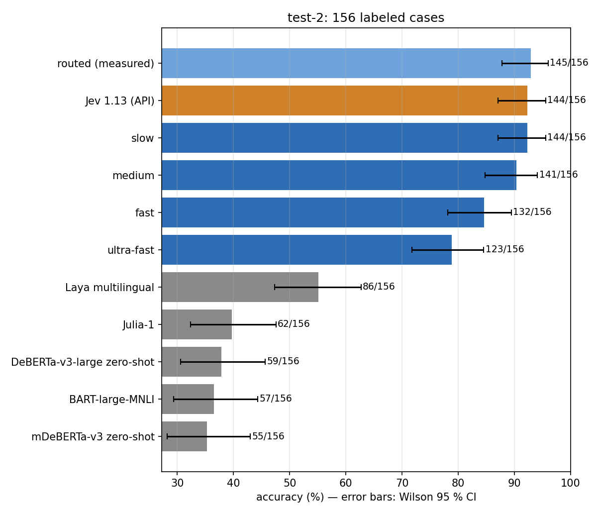
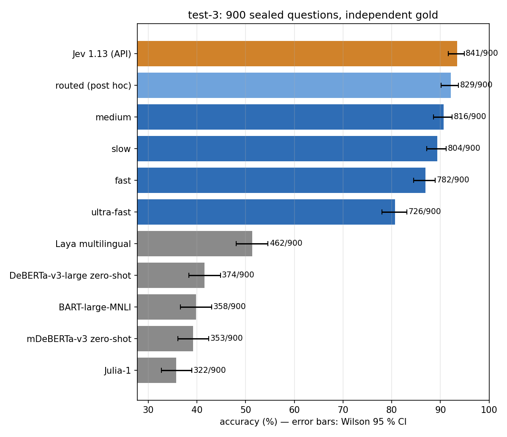
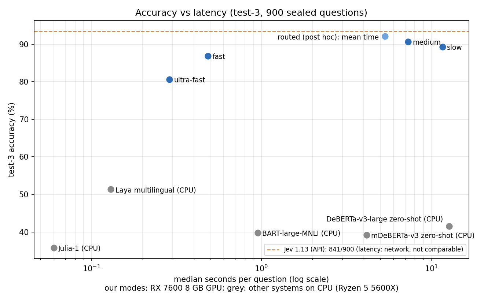
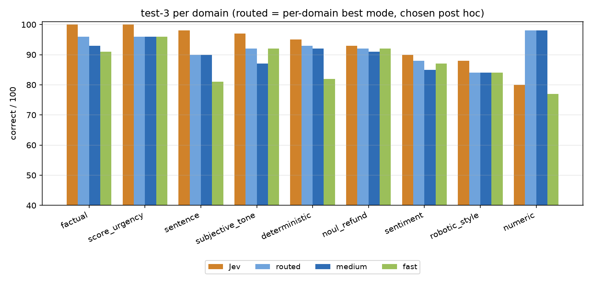

# Results

All numbers below come from committed aggregate reports; nothing here was edited by hand from memory. The
reference system is **Jev 1.13 by TypeSafe, used as reference via its API**. How the numbers were produced (sealed
sets, gold, statistics) is described in [METHODOLOGY.md](METHODOLOGY.md); how we got here in [HISTORY.md](HISTORY.md).

Arm / mode names used throughout:

| name | model | decision | runtime mode |
|---|---|---|---|
| 4B Q8 fast | Qwen3-4B Q8_0 | one forward, read the option letter | `ultra-fast` |
| 8B Q8 fast | Qwen3-8B Q8_0 | one forward, read the option letter | `fast` |
| 4B Q8 think | Qwen3-4B Q8_0 | think up to 1024 tokens, then read the letter | `medium` |
| 8B Q8 short think | Qwen3-8B Q8_0 | think up to 128 tokens, then read the letter | `slow` |
| routed | 4B/8B by domain | per-domain choice among the four above | `routed` |

Charts are generated from the committed reports by `scripts/make_charts.py` (`docs/img/`). Every table below is
sorted from best to worst, with the Jev baseline placed by its own score.

## 1. Comparison of all configurations

Columns: **s/case** = median seconds per case on a 4-vCPU Xeon VM (CPU, llama-cpp-python or PyTorch), except
"(PC)" = a 6-core desktop CPU. **dev+cal** and **test-1** = 45 labeled cases each from corpus 1. **test-2** = 156
labeled / 138 without `numeric` / 120 without `numeric` and `subjective_tone`. **test-3** = 900 sealed primary
questions; Δ vs Jev in percentage points with the conservative 95 % CI. Per-domain columns are test-2 (18 cases
each; `noul` and `score` 24). "—" = not run.

| model | mode | s/case | dev+cal /45 | test-1 /45 | test-2 /156 | /138 | /120 | test-3 /900 | Δ vs Jev [CI] | fact | sent | sentim | tone | robot | num | noul | score |
|---|---|---:|---:|---:|---:|---:|---:|---:|---|---:|---:|---:|---:|---:|---:|---:|---:|
| Jev 1.13 (API) | reference | — | — | 43 | 144 | 135 | 117 | 841 | — | 17 | 18 | 18 | 18 | 17 | 9 | 23 | 24 |
| **Qwen3-4B Q8_0** | **think (1024) (4B Q8 think)** | 45.6 | — | 41 | **141** | **129** | 116 | **816** | **−2.8 [−5.0; −0.6]** | 17 | 18 | 18 | 13 | 17 | 12 | 23 | 23 |
| Qwen3-8B Q8_0 | short think (cap 128, read at 128) | 29.4 | — | — | 144 | 133 | 115 | 804 | −4.1 [−6.2; −2.1] | 16 | 18 | 18 | 18 | 17 | 11 | 22 | 24 |
| **Qwen3-8B Q8_0** | **fast (8B Q8 fast)** | 4.1 | 43 | — | 132 | 126 | 108 | 782 | −6.6 [−8.9; −4.3] | 14 | 14 | 18 | 18 | 15 | 6 | 23 | 24 |
| Qwen3-4B Q8_0 | fast (4B Q8 fast) | 7.5 | 38 | — | 123 | 115 | 108 | 726 | −12.8 [−15.6; −10.0] | 17 | 17 | 14 | 7 | 14 | 8 | 22 | 24 |
| Qwen3-4B-Thinking-2507 Q4_K_M | think (1024) | 117.9 | 42 | — | 142 | 129 | 113 | — | — | 17 | 18 | 18 | 16 | 14 | 13 | 23 | 23 |
| Qwen3-1.7B FP32 | forced think ≥128 (test-2 budget 192) | 38.7 | 41 | — | 120 | 110 | 99 | — | — | 15 | 15 | 17 | 11 | 11 | 10 | 22 | 19 |
| Qwen3-1.7B FP32 | fast | 1.6 | — | 27 | 89 | 83 | 76 | — | — | 9 | 15 | 14 | 7 | 6 | 6 | 15 | 17 |
| Qwen3-0.6B FP32 | fast | 0.6 | — | 21 | 77 | 69 | 63 | — | — | 6 | 8 | 7 | 6 | 12 | 8 | 20 | 10 |
| Qwen3-4B FP32 | think (1024) | 183.2 (PC) | — | 41 | — | — | — | — | — | | | | | | | | |
| Qwen3-4B Q4_K_M | think (1024) | 38.4 | — | 41 | — | — | — | — | — | | | | | | | | |
| Qwen3-4B FP32 | fast | 7.1 (PC) | 38 | 35 | — | — | — | — | — | | | | | | | | |
| Qwen3-1.7B FP32 | think (1024) | 8.2 (PC) | — | 32 | — | — | — | — | — | | | | | | | | |
| Qwen3-0.6B FP32 | think (1024) | 28.4 (PC) | — | 30 | — | — | — | — | — | | | | | | | | |
| Qwen3-8B Q8_0 | think (1024) | 53.3 | 43 | — | — | — | — | — | — | | | | | | | | |
| Qwen3-4B Q8_0 | fast, revised tone prompt | — | 41 | — | — | — | — | — | — | | | | | | | | |
| Qwen3.5-2B FP32 | think (1024) | 181.2 | 39 | — | — | — | — | — | — | | | | | | | | |
| Qwen3-8B Q4_K_M | fast (Q8 parity check) | 4.5 | 39 | — | — | — | — | — | — | | | | | | | | |
| LFM2.5-1.2B-Thinking FP32 | think (1024) | 59.2 | 35 | — | — | — | — | — | — | | | | | | | | |
| Julia-1 (144M encoder + decision head, third-party) | fast, own typed API | 0.1 | 18 | — | — | — | — | — | — | | | | | | | | |

Notes:
- dev+cal numbers for thinking candidates are with the model reading its own thought.
- 8B short think on test-2: the sealed primary reading for that run was at 64 tokens (129/138, criterion missed);
  the 128-token reading was descriptive and became the pre-registered test-3 arm.
- Sources: `reports/test-2/<arm>/summary.json` (`fastpath-06b`, `fastpath-17b`, `fastpath-4b-q8_0`,
  `fastpath-4b-q8_0-a_revised`, `fastpath-8b-q8_0`, `thinking-17b-f192`, `thinking-4b-q4`, `thinking-4b-q8`,
  `thinking-8b-q8-short`, `jev-official`, `jev-replica`), `reports/test-3/results.md`. dev+cal/test-1 numbers of the
  earlier exploration are summarized in [HISTORY.md](HISTORY.md); their per-case artifacts are not shipped.

## 2. test-2 (168 cases, 156 labeled)

| configuration | /156 | /138 no `numeric` | /120 no `numeric`, no tone | s/case (CPU VM) |
|---|---:|---:|---:|---:|
| Jev 1.13 (official run) | 144 | 135 | 117 | network |
| 8B Q8 short think (read at 128) | 144 | 133 | 115 | 29 |
| 4B-Thinking-2507 Q4_K_M think | 142 | 129 | 113 | 118 |
| 4B Q8 think | 141 | **129** | 116 | 46 |
| 8B Q8 fast | 132 | 126 | 108 | 4.1 |
| 4B Q8 fast | 123 | 115 | 108 | 7.5 |

Pre-registered verdicts:
- **Thinking vs fast (138):** 4B Q8 think 129 ≥ 115 + 7 → met (+14, McNemar p = 0.0013).
- **"Jev level" (138):** Jev − model ≤ 5 cases required. 4B Q8 think: difference 6 → **missed by 1 case** (95 % CI of
  the difference [−8.7; −0.7] points). On the 156 set p = 0.58 (CI contains 0); on the 120 set p = 1.0. The
  maintainers accepted this configuration afterwards as the recommended accurate mode; the sealed verdict stands.
- Error analysis: 5 of the 6 cases separating 4B Q8 think from Jev on the 138 set are `subjective_tone`, with the
  thought quoting the rubric's caveat and concluding the wrong level.
- Second labeler: agrees with the corpus author on 77/78 subjective cases (labels in `examples/test-2-labels-b.jsonl`).

## 3. test-3 (900 sealed primary questions, independent gold)

Jev: **841/900 (93.4 %)**. Conservative 95 % CI = union of paired Newcombe and state-level bootstrap. "Jev level" =
lower bound > −3 points. Holm family = the four arms.

| arm | correct /900 | Δ vs Jev (pts) | 95 % CI (conservative) | only Jev / only model | McNemar p | Jev level | beats | s/question (RX 7600, median) |
|---|---:|---:|---|---|---:|---|---|---:|
| Jev 1.13 (API) | 841 | — | — | — | — | reference | — | network |
| **4B Q8 think (≤1024)** | **816** | **−2.8** | [−5.0; −0.6] | 61 / 36 | 0.014 | no | no | 7.3 |
| 8B Q8 short think (≤128) | 804 | −4.1 | [−6.2; −2.1] | 61 / 24 | < 0.001 | no | no | 11.6 |
| 8B Q8 fast (primary) | 782 | −6.6 | [−8.9; −4.3] | 87 / 28 | < 0.001 | no | no | **0.48** |
| 4B Q8 fast | 726 | −12.8 | [−15.6; −10.0] | 144 / 29 | < 0.001 | no | no | 0.29 |

- **No arm reaches Jev level.** The closest is 4B Q8 think: point estimate inside the margin, lower bound −5.0.
- **Thinking helps both sizes:** 4B 726 → 816; 8B 782 → 804 (descriptive: 8B short − 8B fast = +2.4 points,
  CI [0.7; 4.3]).

### By level (Δ vs Jev, points)

| arm | N1 (170) | N2 (363) | N3 (367) |
|---|---:|---:|---:|
| 4B Q8 think | −2.4 | −3.9 | −1.9 |
| 8B Q8 short think | 0.0 (Jev level) | −3.6 | −6.5 |
| 8B Q8 fast | −2.9 | −6.6 | −8.2 |
| 4B Q8 fast | −7.1 | −14.0 | −14.2 |

For the fast arms the gap grows with difficulty; 4B Q8 think is the only arm without that gradient.

### By domain (correct /100; margin −8 points)

| domain | Jev | 4B Q8 think | 8B Q8 short think | 8B Q8 fast | 4B Q8 fast |
|---|---:|---:|---:|---:|---:|
| factual | 100 (ceiling) | 93 | 96 | 91 | 91 |
| numeric | 80 | **98 (beats Jev)** | 77 | 77 | 72 |
| deterministic | 95 | 92 | 93 | 82 | 88 |
| sentence | 98 (ceiling) | 90 | 85 | 81 | 82 |
| sentiment | 90 | 85 | 88 | 87 | 86 |
| subjective_tone | 97 (ceiling) | 87 | 92 | 92 | **52** |
| robotic_style | 88 | 84 | 84 | 84 | 76 |
| noul_refund | 93 | 91 | 93 | 92 | 84 |
| score_urgency | 100 (ceiling) | 96 | 96 | 96 | 95 |

- **Only "beats":** 4B Q8 think on `numeric`, 98 vs 80, +18 [9.7; 27.0], significant after Holm over 9 domains.
  Arithmetic is Jev's weak spot and thinking solves it.
- Ceiling: where Jev ≥ 97 % "beats" is reported as not measurable.
- 4B Q8 fast collapses on tone (52/100) and on `noul` (recall of class `false` 0.76 < 0.80 = collapse by the
  pre-registered rule).

### Secondary metrics (no verdict)

| arm | mean abs. `score` level error | `noul` recall false / true | TV on `random` | Δ constructed | Δ dataset (74) | Δ judged | Δ unanimous R1=R2 |
|---|---:|---|---:|---:|---:|---:|---:|
| 4B Q8 think | 0.04 | 0.87 / 0.97 | 0.36 | +2.7 | −2.7 | −5.9 | −5.8 |
| 8B Q8 short think | 0.05 | 0.92 / 0.95 | 0.48 | −3.0 | +2.7 | −5.7 | −4.4 |
| 8B Q8 fast | 0.06 | 0.94 / 0.89 | 0.46 | −8.3 | +4.1 | −7.0 | −5.8 |
| 4B Q8 fast | 0.05 | **0.76** / 0.97 | 0.51 | −8.0 | −6.8 | −16.3 | −15.3 |

Full tables per level, domain and stratum: `reports/test-3/results.md` / `results.json`.

### Cost on an AMD RX 7600 (8 GB), llama.cpp b11205 Vulkan, cold prefill, batch 1

| arm | median s/question | total (953 questions) | thought length (median) | closes `</think>` by itself | peak RAM |
|---|---:|---:|---:|---:|---:|
| 4B Q8 think | 7.3 (mean 9.1) | ~2.4 h | 269 | 904 / 953 | 13.1 GB |
| 8B Q8 short think | 11.6 | ~3.1 h | 128 (cap) | 26 / 953 | 17.0 GB |
| 8B Q8 fast (30/36 layers on GPU) | 0.48 | ~8 min | — | — | 17.0 GB |
| 4B Q8 fast | 0.29 | ~5 min | — | — | 13.0 GB |

Jev API: 649 requests, 389 251 input tokens, ~0.016 USD at 0.042 USD per million input tokens (an assumed price that
was not confirmed with the vendor).

## 4. Routed mode

Combined on test-3 from the four arms' answers with the shipped map: **829/900** (Jev 841, −1.3 points). This
number is optimistic by construction (the map was chosen on these results), so it carries no CI or verdict.

### 4.1 Router validation on test-2 (no new model runs)

The router was chosen **post hoc on test-3**: per domain, the arm with the best accuracy, the fastest on ties. It
was then validated on test-2 with existing predictions (pre-registered before computing any router number).

| configuration | rule |
|---|---|
| **E (router)** | `numeric`, `sentence` → 4B Q8 think; `factual`, `deterministic`, `sentiment` → 8B Q8 short think; `subjective_tone`, `robotic_style`, `noul_refund`, `score_urgency` → 8B Q8 fast |
| **V (cheap variant)** | 8B Q8 fast everywhere except `numeric` → 4B Q8 think |

| configuration | /156 | /138 no `numeric` | s/question (test-2 mix) | s/question (test-3 mix) |
|---|---:|---:|---:|---:|
| Jev | 144 | 135 | — | — |
| 8B Q8 short think | 144 | 133 | 11.62 | 11.62 |
| **E** | **144** | 132 | 4.94 | 5.34 |
| 4B Q8 think | 141 | 129 | 8.26 | 8.30 |
| V | 138 | 126 | 1.34 | 1.41 |
| 8B Q8 fast | 132 | 126 | 0.48 | 0.48 |
| 4B Q8 fast | 123 | 115 | 0.29 | 0.29 |

Times are estimates: per-domain mean times measured on the RX 7600 in test-3, weighted by each set's domain mix.

| comparison | Δ (pts) | 95 % CI (paired bootstrap) | only A / only B | McNemar p |
|---|---:|---|---|---:|
| E − Jev | +0.0 | [−3.8; 3.8] | 5 / 5 | 1.0 |
| V − Jev | −3.8 | [−9.0; 1.3] | 5 / 11 | 0.21 |
| E − 8B Q8 fast | +7.7 | [3.2; 12.2] | 13 / 1 | 0.0018 |
| E − 4B Q8 fast | +13.5 | [7.1; 19.9] | 26 / 5 | 0.0002 |
| E − 8B Q8 short think | +0.0 | [−3.8; 3.8] | 4 / 4 | 1.0 |
| E − 4B Q8 think | +1.9 | [−1.9; 6.4] | 7 / 4 | 0.55 |
| V − 8B Q8 fast | +3.8 | [0.6; 7.7] | 7 / 1 | 0.07 |

| domain | E | Jev | 8B Q8 short think | 4B Q8 think | V | 8B Q8 fast | 4B Q8 fast |
|---|---:|---:|---:|---:|---:|---:|---:|
| factual | 16/18 | 17/18 | 16/18 | 17/18 | 14/18 | 14/18 | 17/18 |
| noul_refund | 23/24 | 23/24 | 22/24 | 23/24 | 23/24 | 23/24 | 22/24 |
| numeric | 12/18 | 9/18 | 11/18 | 12/18 | 12/18 | 6/18 | 8/18 |
| robotic_style | 15/18 | 17/18 | 17/18 | 17/18 | 15/18 | 15/18 | 14/18 |
| score_urgency | 24/24 | 24/24 | 24/24 | 23/24 | 24/24 | 24/24 | 24/24 |
| sentence | 18/18 | 18/18 | 18/18 | 18/18 | 14/18 | 14/18 | 17/18 |
| sentiment | 18/18 | 18/18 | 18/18 | 18/18 | 18/18 | 18/18 | 14/18 |
| subjective_tone | 18/18 | 18/18 | 18/18 | 13/18 | 18/18 | 18/18 | 7/18 |

Reading (declared before computing): E keeps on test-2 the order it had on test-3 relative to the best single arm
(not worse, CI includes 0), so the post-hoc choice is **not contradicted**. No "Jev level" verdict is drawn from
test-2 (minimum detectable difference ~6–8 points at n = 156). Source: `reports/test-3/router-test2.md`.

### 4.2 Real runtime measurement (released server, test-2, RX 7600)

The released runtime (`python -m typed_decisions serve`) was measured end to end on the 168 test-2 cases, with a
pre-registered plan. Source: `reports/runtime-measurement/summary.json`.

| step | result | pre-registered criterion | |
|---|---|---|---|
| `ultra-fast` (4B, 168) | argmax equal to the CPU test-2 predictions in **163/168 (97.0 %)** | ≥ 99 % | missed |
| `fast` (8B, 168) | argmax equal in **166/168 (98.8 %)** | ≥ 99 % | missed by 1 case |
| `medium`, `slow` (3 cases each) | all answered, all option letters present | respond | met |
| **`routed` (168)** | **145/156** correct (1 question failed and counts as wrong) | 144 ± 2 | met |

Cause of the two misses, established after the fact: **the inference engine, not the runtime.** Runtime prompts are
token-identical to the CPU harness prompts on all 168 cases; an independent harness on the same llama-server GPU build
agrees with the runtime 168/168 and diverges from the CPU predictions on the same 5 cases. The test-2 predictions were
produced with llama-cpp-python 0.3.35 on CPU. With the GPU engine, 4B Q8 fast goes from 123 to **120**/156; 8B Q8
fast stays at 132.

| routed measurement | value |
|---|---|
| accuracy | 145/156 (factual 15/17 + 1 failed · numeric 14/18 · sentence 18/18 · sentiment 18/18 · subjective_tone 18/18 · robotic_style 15/18 · noul_refund 23/24 · score_urgency 24/24) |
| time per question | **mean 4.50 s**, median 0.50 s (756 s for 168); 4.27 s excluding requests that loaded a model |
| model loads | 5 (first load + 4 switches), in the file's domain-grouped order; requests with a load took 6.0–16.9 s |
| median per mode | fast 0.45 s · medium 7.39 s · slow 11.41 s |
| peak RAM (process tree) | 12.0 GB (8B part); 8.0 GB (4B part) |
| peak VRAM | 7.2 GB with the 8B (30/36 layers on GPU); 5.2 GB with the 4B |

Defects found and their status: (1) one `slow` question failed because an option letter fell outside the top-20
returned probabilities after thinking; the runtime now defaults to 256 probabilities in thinking modes and returns a
per-question `errors` entry instead of failing the whole request. (2) The routed config had no route for `random`;
`"random": "fast"` was added (these cases are scored by TV, not accuracy). Traffic with shuffled domains would
cause more model switches (5–12 s each); that scenario was not measured.

## 5. Comparison with similar projects

Same sealed sets, same gold, same scoring; sorted by test-3 accuracy. The numbers for the other systems come from
a pre-registered comparison run; its aggregate results (per level, per domain, paired CIs against Jev, `fast` and
`medium`, test-2 subsets) are in [`reports/comparison/results.md`](../reports/comparison/results.md) and `results.json`, summarised in
`reports/comparison.json` (which `scripts/make_charts.py` reads). Per-item predictions are not shipped. Latency is
median seconds per question on the stated hardware.

| system | type | test-3 /900 | Δ vs Jev on test-3 [95 % CI] | test-2 /156 | median s/question | hardware |
|---|---|---:|---|---:|---:|---|
| Jev 1.13 by TypeSafe (baseline, via its API) | hosted typed-decision API | 841 | — | 144 | network | remote |
| local-typed-decisions `routed` | per-domain mode | 829 (post hoc) | −1.3 (no CI: post hoc) | 145 (measured) | 0.50 (mean 4.5) | RX 7600 8 GB |
| local-typed-decisions `medium` (Qwen3-4B Q8_0, think ≤ 1024) | local LLM, thinking + readout | 816 | −2.8 [−5.0; −0.6] | 141 | 7.3 | RX 7600 8 GB |
| local-typed-decisions `slow` (Qwen3-8B Q8_0, think ≤ 128) | local LLM, thinking + readout | 804 | −4.1 [−6.2; −2.1] | 144 | 11.6 | RX 7600 8 GB |
| local-typed-decisions `fast` (Qwen3-8B Q8_0) | local LLM, letter readout | 782 | −6.6 [−8.9; −4.3] | 132 | 0.48 | RX 7600 8 GB |
| local-typed-decisions `ultra-fast` (Qwen3-4B Q8_0) | local LLM, letter readout | 726 | −12.8 [−15.6; −10.0] | 123 | 0.29 | RX 7600 8 GB |
| Laya multilingual (~322M, decision heads, third-party) | small model, typed heads | 462 | −42.1 [−45.9; −38.1] | 86 | 0.13 | CPU (Ryzen 5 5600X) |
| DeBERTa-v3-large zero-shot classifier | zero-shot NLI | 374 | −51.9 [−55.3; −48.2] | 59 | 12.8 | CPU (Ryzen 5 5600X) |
| BART-large-MNLI zero-shot classifier | zero-shot NLI | 358 | −53.7 [−57.1; −50.1] | 57 | 0.95 | CPU (Ryzen 5 5600X) |
| mDeBERTa-v3 zero-shot classifier (multilingual) | zero-shot NLI | 353 | −54.2 [−57.7; −50.8] | 55 | 4.2 | CPU (Ryzen 5 5600X) |
| Julia-1 (144M encoder + decision head, third-party) | small encoder, typed API | 322 | −57.7 [−61.3; −54.0] | 62 | 0.06 | CPU (Ryzen 5 5600X) |

The other systems were run by the maintainers on CPU (AMD Ryzen 5 5600X), pre-registered, on the same sealed sets
with the same gold and scoring, each model as released; the Jev, `medium` and `fast` reference values were reproduced
in the same analysis. Every one differs from Jev, `fast` and `medium` with McNemar p < 1e-60 on test-3, with no
errors, unanswered or truncated questions. mDeBERTa-v3 was added because the test-3 texts are mostly Portuguese.
Their latencies are CPU numbers and are not directly comparable with our GPU numbers. **GLiClass was not included:**
it follows the same zero-shot label-matching paradigm as the NLI classifiers, has no `Score` or `Noul` equivalent,
and needs a third-party library.

test-2 numbers for the local modes are from the CPU engine (llama-cpp-python) except `routed`, which was measured
with the released GPU runtime; on the GPU engine `ultra-fast` scores 120. The `routed` test-3 number is combined
from the four modes with a map chosen on test-3, so it is optimistic.

## 6. Caveats

1. **Authored-item gold has no human audit.** The judged stratum (526 of 900) is validated by agreement between two
   blind LLM labelers (97.4 %, κ 0.973 on the first package; 35/35 on the second) and by an LLM adjudicator
   (17 disagreements: 12 decided, 5 excluded as ambiguous). Author intent agrees with gold on 566/576 (98.3 %), but
   the authors are also LLM sessions. A bias shared by all these sessions would not show up in any of these
   agreements. A stratified 60-item human audit sample is ready in `labels/test-3/audit-sample.jsonl` but has not
   been labeled. Results therefore carry the warning **"LLM gold, not human-validated"**.
2. **Engine drift CPU vs GPU ≈ 3 %.** Moving from llama-cpp-python on CPU to llama.cpp b11205 Vulkan changed 5/168
   argmax for the 4B and 2/168 for the 8B. test-2 numbers are CPU; test-3 and runtime numbers are GPU.
3. **The router was chosen post hoc on test-3** and only confirmed on test-2, which had already been seen. A new
   sealed set is needed to confirm it (see [OPEN_WORK.md](OPEN_WORK.md)).
4. **Probabilities are uncalibrated.** Probabilities are a softmax over the option letters only; confidence is
   1 − normalized entropy. After thinking they are close to 1.0 and are not a usable uncertainty.
5. **Jev invalid responses.** At least 2 API responses had a distribution that did not sum to 1; the runner stopped
   without storing them and, on resume, the same state was requested again and the first valid answer stored. The
   invalid ones were not kept, so their number and content are unknown.
6. **Per-item Jev outputs are withheld.** They come from a commercial API; only aggregate numbers are shipped. Scripts
   that need them (router validation, paired statistics) run only if you supply your own baseline predictions.
7. **Dataset stratum contamination.** Banking77 and GoEmotions texts are public and may be in the pretraining data of
   both sides; they are reported as a separate stratum.
8. **Minor run notes (no effect on the numbers):** in 8B short think, 2 option letters fell outside `n_probs = 20` on
   two `score_urgency` items (model put ~1.0 on another level; argmax unchanged). The 8B short arm ran with context
   2048 instead of 4096 because a 4096 KV cache with 30 layers on GPU does not fit in 8 GB of VRAM (longest prompt 282
   tokens + 128 thought tokens).
9. **Labeling process deviations:** the adjudicator saw 22 of labeler 2's labels before adjudicating (1 of them fell
   among the disagreements); one author's declaration showed aggregate intent counts while R1 and R2 were working; no
   "hesitated" flag occurred among the 35 N3 items of package 2, suggesting that for LLM labelers difficulty is mostly
   structural.
